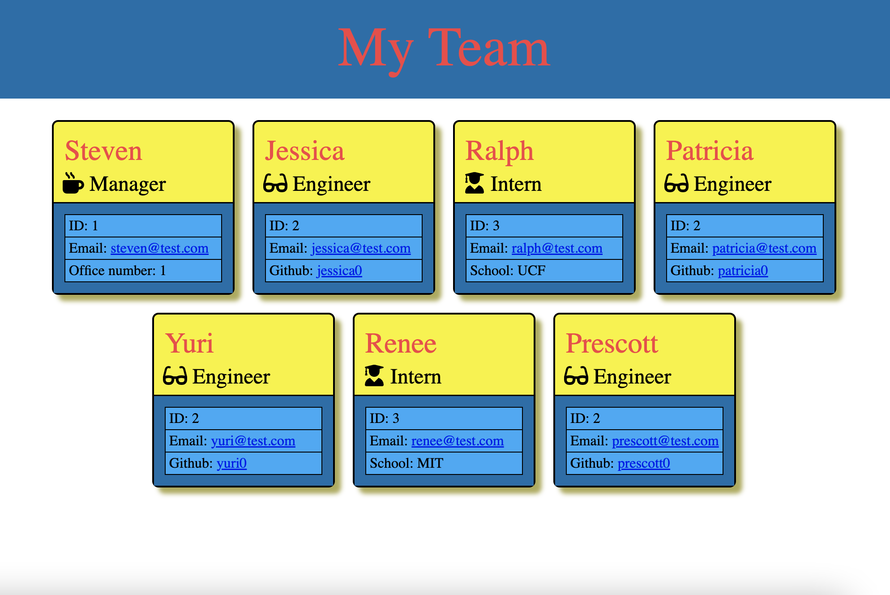

# Team Profile Generator #

## Objective ##

>This team member profile generator is a simple HR command line application that produces an html file from user input. The main goal of the project was to weild object-oriented programming techniques by writing a library of class definitions for use by the application's javascript files.
 
## Challenges

>The biggest challenge this project presented was constructing the long string literals for precise formatting in the final html file. An early iteration of the code worked well-enough and rendered in the browser without any problems but produced a poorly-formatted, hard-to-read html file. The resulting html file now not only renders nicely but it looks good too.

## Built with:

* HTML
* CSS
* Javascript

## Here is a screenshot of the finished page:

## License

> Naturally, I have not included a license for this simple exercise. :)

## Contributions:

>Made from scratch with ❤️ by Jonathan Price.
